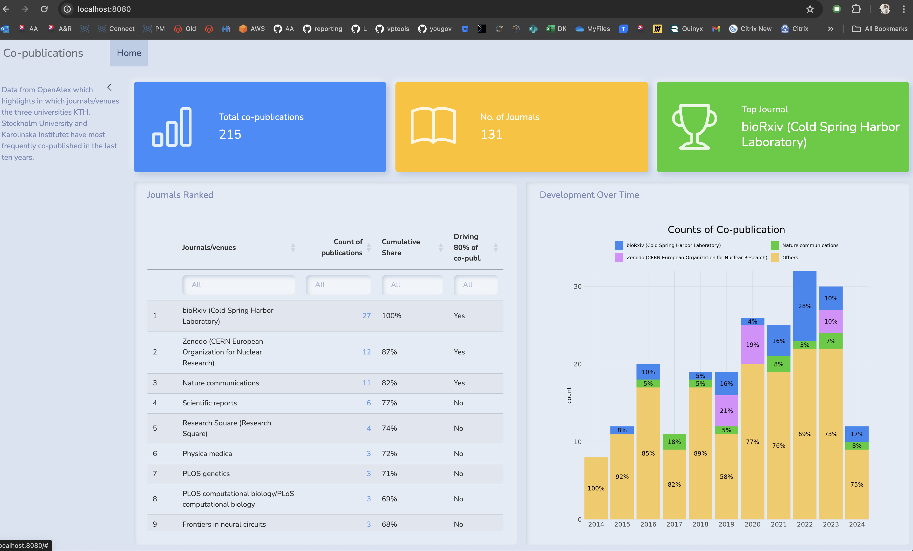

# Brief

Create a Quarto Dashboard using open data from OpenAlex which highlights in which journals/venues the three universities KTH, Stockholm University and Karolinska Institutet have most frequently co-published in the last ten years.
Render the content and bundle the result in a container as static web content to be served from the subpath “dashboards/dauf-exercise”.

# Results

-   A quarto dashboard fetching data from the OpenAlex API summarizing in which journals/venues the three universities KTH, Stockholm University and Karolinska Institutet have most frequently co-published in the last ten years.
-   The table visualizes how the three top journals/venues account for over 80% of the co-publications.
-   A plot was added to visualize the development of the top journals/venues over time.
-   The dashboard is styled using mainly the Morph Quarto theme but also using some custom CSS for outputs.

# Docker

Being the first time I used docker containers with R and quarto I followed the instructions in the article on how to set up Quarto with Docker by [analythium](https://github.com/analythium/quarto-docker-examples).

I did not have time to set up a github workflow with actions.
Automating the rendering and publishing of a dashboard using GitHub Actions is a great way to ensure that the dashboard stays up-to-date and accessible to users.
If I had my time to spend on this I would, :

Set up the Repository:

-   Create a GitHub repository for your dashboard.
    Clone the repository to your local machine and add your Quarto R dashboard files to it.
    Create a GitHub Action Workflow:

-   Inside your repository, create a directory named .github/workflows.
    Create a YAML file inside this directory, for example, render-and-publish.yml.
    Define the Workflow:

-   Define a workflow that will be triggered periodically (once per day in this case) to render and publish the dashboard.
    Use a scheduled event trigger to run the workflow daily.
    Specify the jobs and steps required to render the dashboard and publish it to GitHub Pages.

# QA.R file

-   I also did not have time to look into the `qa.R` script to discover the data quality issue and then explain what it does and discuss my findings and thoughts around how I would proceed in a data quality investigation such as this one.
